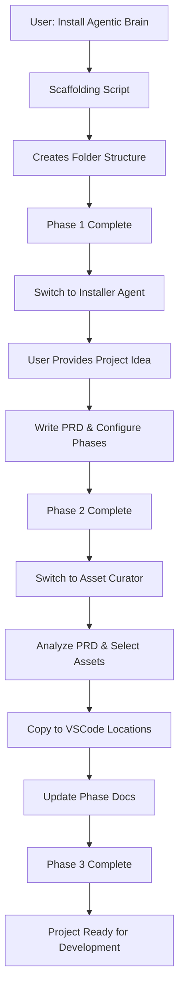
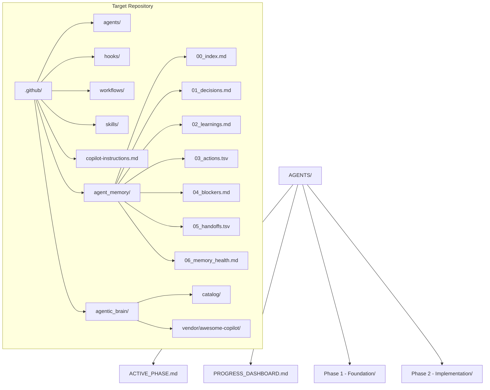
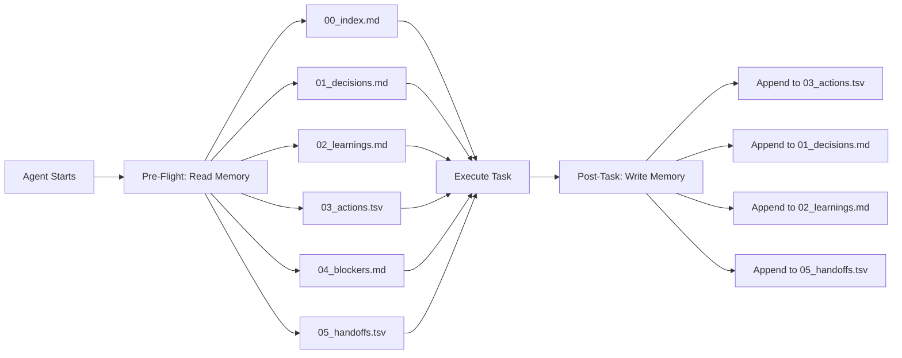

# Agentic Brain

Agentic Brain is an installable, repo-adaptive Copilot workflow template.

It combines:
- phase-gated execution (`AGENTS/`),
- structured custom-agent orchestration (`.github/agents/`),
- an importable core subset from `awesome-copilot-main`, and
- an append-only second-brain memory graph (`.github/agent_memory/`).

## Documentation Map

- Installation guide: [INSTALLATION.md](INSTALLATION.md)
- Product requirements template: [PRD_TEMPLATE.md](PRD_TEMPLATE.md)
- Universal execution protocol: [prompt.md](prompt.md)
- Copilot workflow contract template: [.github_templates/copilot-instructions.md](.github_templates/copilot-instructions.md)
- Active phase state template: [AGENTS_templates/ACTIVE_PHASE.md](AGENTS_templates/ACTIVE_PHASE.md)
- Progress dashboard template: [AGENTS_templates/PROGRESS_DASHBOARD.md](AGENTS_templates/PROGRESS_DASHBOARD.md)
- Phase README template: [AGENTS_templates/PHASE_TEMPLATE/README.md](AGENTS_templates/PHASE_TEMPLATE/README.md)
- Phase checklist template: [AGENTS_templates/PHASE_TEMPLATE/CHECKLIST.md](AGENTS_templates/PHASE_TEMPLATE/CHECKLIST.md)

## What This Template Does

When a user asks Copilot to install Agentic Brain in any repository, the installer flow will:
1. Detect the target repository stack and commands.
2. Import only the awesome-copilot core subset (agents, instructions, skills, hooks, workflows, plugins).
3. Build a searchable local catalog of imported assets.
4. Generate a curated required-agent set for the detected repo profile.
5. Bootstrap a strict append-only memory graph with linked ledgers and logs.

## Installation Flow



## Folder Structure



## Memory System



## Core Subset Scope

The local `awesome-copilot-main/` snapshot is intentionally limited to:
- `agents/`
- `instructions/`
- `skills/`
- `hooks/`
- `workflows/`
- `plugins/`
- `LICENSE`
- `README.md`

Other upstream folders (for example docs, website, eng, and workflow infrastructure) are excluded from this template to keep installation deterministic and lightweight.

## High-Level Layout

- `AGENTS_templates/`: source templates for `AGENTS/` phase tracking and execution.
- `.github_templates/`: source templates for `.github/` copilot instructions, agents, and memory.
- `awesome-copilot-main/`: local corpus used for import and curation.
- `scripts/`: installer, indexing, curation, and memory-bootstrap automation.
- `schemas/`: machine-readable schema contracts for metadata, state, handoffs, and memory entries.
- `PRD_TEMPLATE.md`: repo-adaptive PRD contract consumed by the installer and orchestration flow.

## Install Trigger (Copilot Chat)

Use natural language in a target repo, for example:
- "Install Agentic Brain for this repository."
- "Install Agentic Brain and set up memory plus required custom agents."

The expected behavior is:
1. Copilot identifies the target repository (your actual project, NOT the Agentic Brain template folder)
2. Copilot executes the scaffolding script targeting your project folder
3. Copilot outputs instructions to switch to "Copilot Agentic Brain Installer" agent
4. The installer agent then curates agents, instructions, hooks based on project idea

## ⚠️ Critical: Target Repository

**Always install INTO your project, NOT into the Agentic Brain template folder.**

- The template folder is `Agentic-Brain/` - this is just the installer
- Your actual project is where you want Agentic Brain to run
- Example: If your project is at `Desktop/my-chrome-extension/`, run the scaffolding there

## Three-Phase Installation Flow

### Phase 1: Scaffolding
When the user says "Install Agentic Brain for this repository", Copilot will:
1. Run the scaffolding script: `node scripts/scaffold-agentic-brain.mjs --target "<repoRoot>"`
2. This creates empty/placeholder folders and base memory files:
   - `.github/copilot-instructions.md`
   - `.github/agent_memory/` (with templates)
   - `.github/agentic_brain/` (empty catalog/vendor folders)
   - `.github/agents/` (empty - will be populated by installer)
   - `.github/hooks/` (empty - will be populated by installer)
   - `.github/workflows/` (empty - will be populated by installer)
   - `.github/skills/` (empty - will be populated by installer)
   - `AGENTS/` (with placeholder phases)
   - `PRD_TEMPLATE.md`
3. Copilot tells the user to switch to "Copilot Agentic Brain Installer" agent

### Phase 2: PRD & Phase Configuration
When the user switches to "Copilot Agentic Brain Installer" and provides their project idea:
1. Collect project idea/need from the user
2. Write detailed PRD based on the idea
3. **Copy this agent to `.github/agents/agentic-brain-installer.agent.md`** (CRITICAL - makes it available for future use)
4. Detect repository profile (frontend/backend/fullstack/etc.)
5. Define phase structure based on PRD
6. Configure each phase with README and checklist
7. Update memory index and progress dashboard

### Phase 3: Asset Selection & Import (Asset Curator Agent)
1. Installer hands off to **Agentic Brain Asset Curator** agent
2. Asset Curator reads PRD, analyzes project requirements
3. Selects appropriate agents, hooks, workflows, skills from awesome-copilot
4. Copies to correct VSCode-mandated locations
5. Updates phase documentation with selections

**Key Principles:**
- No pre-set agents in `.github_templates/agents/` — all agents are curated fresh per-project
- The installer ALWAYS works OUTSIDE the Agentic Brain template folder
- The installer continues until complete — only stops on blockers requiring user intervention
- Every agent MUST load `.github/copilot-instructions.md` at startup (no exceptions)
- Assets MUST go to VSCode-mandated locations: `.github/agents/`, `.github/hooks/`, `.github/workflows/`, `.github/skills/`

## Local Script Install (Deterministic)

Run from this template root to install into a target repository path:

```powershell
node .\scripts\install-agentic-brain.mjs --target "C:\path\to\target-repo"
```

Optional flags:
- `--source <path>`: override awesome-copilot source location.
- `--mode install|update`: new install or merge update.
- `--profile auto|frontend|backend|fullstack|data|infra`: force repo profile.

## Installation Outputs

The installer writes:
- target `.github/` from `.github_templates/`.
- target `AGENTS/` from `AGENTS_templates/`.
- target `.github/agentic_brain/vendor/awesome-copilot/` (core subset only).
- target `.github/agentic_brain/catalog/awesome-catalog.yaml` (index).
- target `.github/agentic_brain/catalog/required-assets.yaml` (curated required set).
- target `.github/agent_memory/` append-only memory graph and install logs.

## Persistent Memory Contract

Memory is repository-local and append-only by default:
- `00_index.md`: graph index and reference map.
- `01_decisions.md`: immutable decision ledger.
- `02_learnings.md`: learnings and patterns.
- `03_actions.tsv`: chronological action telemetry ledger.
- `04_blockers.md`: active/resolved blockers.
- `05_handoffs.tsv`: append-only handoff telemetry ledger.
- `06_memory_health.md`: periodic health and link checks.

Every phase checklist entry must link to memory evidence entries.

## Safety and Attribution

- Source corpus subset: `awesome-copilot-main` core folders and license/readme (MIT licensed).
- External/untrusted remote plugin ingestion is disabled by default.
- Imported asset metadata includes provenance path and source label.

## Development Roadmap

- Phase 1: schema-first contracts and installer workflow docs.
- Phase 2: corpus ingestion and searchable catalog.
- Phase 3: deterministic curation and required-agent generation.
- Phase 4: strict memory graph with append-only logging and health checks.
- Phase 5: update mode, validation, and profile scenario testing.
